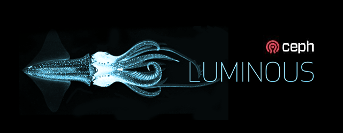

_Red Hat Ceph Storage 3.2 brings a new round of enhancements_

We are pleased to announce today’s immediate availability of Red Hat Ceph Storage 3.2, our fifteenth RHCS release. There are several highlights with this version, the most notable of which is the introduction of full support for BlueStore. As you definitely already know, BlueStore delivers very significant performance improvements to all Ceph users.

#   BlueStore

Red Hat Ceph Storage 3.2 introduces GA support for the next-generation BlueStore backend. BlueStore delivers a 2X performance improvement for clusters that are HDD-backed, as it removes the so-called double-write penalty that IO-limited storage devices (like hard disk drives) are most affected by. Additionally, BlueStore provides significant performance enhancements in all-SSD configurations, as detailed in our recent [whitepaper](http://bit.ly/2RhZqRW) with Micron. The key highlights of an all-NVME configuration benchmark are below:

Even in solid-state configurations, there are sizable improvements in throughput and IOPS at the 4M block size, and the huge improvements in read and write tail latency are interesting for future reference as we consider our moves around more jitter-sensitive workloads. BlueStore is in use in production at several customer sites already, under support exception agreements, and with no quality issues of note. With this release, all customers have the same access to BlueStore for production use.

Of course, performance is never simple, and a million details apply. The best treatment of BlueStore is in [Sage’s blog](https://ceph.com/community/new-luminous-blueStore/). Short of running your own benchmark, it remains the best reading you can do on of the topic.

BlueStore can run against a combination of slow and fast devices, similar to FileStore, except that BlueStore is generally able to make much better use of the fast device. The _db_ and _WAL_ devices are to be allocated space on the SSD devices of a mixed cluster, with spill-over to the main device kicking in if the device is too slow. We committed patches upstream to make BlueStore as

As a backend migration would be operationally inappropriate for a point release, we expect new, greenfield clusters to be deployed with BlueStore going forward, while clusters upgraded from 3.1 will continue using Filestore until the 3.2 -> 4.0 major upgrade levels all clusters up to a BlueStore backend. Expert customers like OpenStack site administrators who want to upgrade to BlueStore in 3.2 manually will receive assistance in doing so and are to contact Support for assistance. Customers who have a more hands-off attitude towards their storage should wait for the 4.0 release, where our Ansible automation will make the entire process transparent to the user.

#   Backup

Alongside our primary OpenStack storage and S3 Object Store and Data Lake use cases, we are enabling a new use case of RHCS as a storage target for backup data storage. We have been pursuing partner certifications during the past year, and now have passed the following certifications:

- Veritas NetBackup OpenStorage (OST) — versions 7.7 and 8.0  
    
- Rubrik Cloud Data Management (CDM) — versions 3.2 and later  
    
- NetApp AltaVault — versions 4.3.2 and 4.4  
    
- Trilio, TrilioVault — versions 3.0
- Veeam Backup & Replication — version 9.x

This was no small effort on the part of the RGW team given all the other work on their plate, special thanks go to all involved.

#   OpenStack

3.2 also delivers timely storage support for the upcoming Red Hat OpenStack Platform 14 release. We are really pleased to be able to provide Ceph support on the GA date as has been the case with just a single exception all the way back to OpenStack Platform 7.

Least but not last, 3.2 features tech-preview version of Erasure Coding for RBD and CephFS. EC for RBD has been a long awaited feature request from the OpenStack user base, and we are approaching general availability as the code has reached stability and tuning remains the last outstanding task.

As always, those of you with an insatiable thirst for detail should read the [release notes](https://access.redhat.com/documentation/en-us/red_hat_ceph_storage/3.2/html/release_notes/) next—and feel free to ping me on [Twitter](https://twitter.com/0xf2) if you have any questions!

Source: Federico Lucifredi ([BlueStore Unleashed](https://f2.svbtle.com/ceph-bluestore-unleashed))
