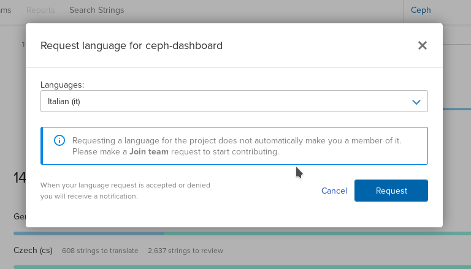

_(This is a guest post by Sebastian Krah from the Ceph Dashboard Team. He is coordinating the efforts around localization and internationalization of the Dashboard)_

Ceph Dashboard is the perfect entry point for everyone who is interested in Ceph and prefers working with a graphical user interface.

Like every good UI, the Dashboard can be used in different languages and these can be changed at run-time.

Since the Dashboard gets a wider audience, internationalization is becoming more and more important and that's why I'd like to give you a brief overview over the translation process today.

After the translations source file has been extracted from the source code, it will be uploaded to a cloud-based localization platform called [Transifex](https://www.transifex.com/).

Transifex is free of charge for open source projects and we are grateful for being able to use their platform for our purposes. Another advantage is that Transifex provides a very useful API that we can use to automate the integration of the translations. Once a language reaches a defined threshold of translated strings, we add it to the Ceph Dashboard.

One challenge is to keep the translations up to date. The Dashboard is under heavy development, which will add or remove translatable strings from time to time.

At this point, we would like to ask you, our community, to help us in ensuring that existing translations remain complete and that we can provide the Ceph Dashboard in as many different languages as possible!

If you want to support us, all you need is a free user account on Transifex. You can use your github credentials for logging in. After you've created one, you can [join our translation team](https://www.transifex.com/ceph/ceph-dashboard/dashboard/) by selecting the languages you want to translate.

Ceph Dashboard Language Dashboard on Transifex

On the Transifex [ceph-dashboard project overview](https://www.transifex.com/ceph/ceph-dashboard/dashboard/) you can see a localization activity stream and all languages we support.

If you cannot find the language you want to translate in, feel free to request it.

Once you've selected a language, you have to select a resource. Resources are basically the different Ceph versions (Nautilus, Octopus etc.). The 'Master' resource is the current development version.

Transifex Resource Selection

Now that you have selected a resource, you can start translating, reviewing and commenting. On the left side of your screen, you can apply filters and select a string you want to change. On the right side, you can add or update the translation, review it or leave a comment.

We would greatly appreciate your help and if you have any questions, please don't hesitate to get in contanct with us via IRC on #ceph-dashboard on OFTC or the devel@ceph.io mailing list - see [https://ceph.io/irc/](https://ceph.io/irc/) for details on how to join these channels. Thank you!
