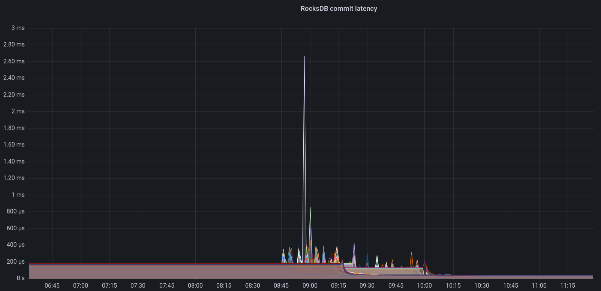

~~There is no~~ silver bullet regarding RocksDB performance. Now that I got your attention: you might be "lucky" when you are using upstream Ceph Ubuntu packages.

### TL;DR
Mark Nelson [found out](https://ceph.io/en/news/blog/2024/ceph-a-journey-to-1tibps/#fix-three) that [before](https://github.com/ceph/ceph/pull/54918) PR was merged the build process did not properly propagate the `CMAKE_BUILD_TYPE` options to external projects built by Ceph, in this case, RocksDB. [Before](https://github.com/ceph/ceph/pull/24133) packages were built with the `RelWithDebInfo` to build a "performance" release package. While this has not been verified, it is possible that upstream Ceph Ubuntu packages have suffered from this since some version of Luminous.

# Acknowledgments

Thanks to Mark Nelson for finding and fixing this issue. Thanks to Kefu Chai for providing a fix for the build system. Thanks to Casey Bodley for taking care of creating the backport trackers. Thanks to my employer [BIT](https://www.bit.nl) for having me work on Ceph, and Els de Jong for editing.

### So what does this mean?

RocksDB performance is sub-optimal. This can be improved by running peformance packages. The actual performance increase depends on the cluster, but the RocksDB compaction time seems to be reduced by a factor of three. In some cases random 4K write performance is doubled. See these links ...

### How can I fix this?

1) install a version where this problem is resolved for the release you are running: [Pacific](https://tracker.ceph.com/issues/64362), [Quincy](https://github.com/ceph/ceph/pull/55501),[Reef](https://github.com/ceph/ceph/pull/55502)

2) If you are running an EOL version of Ceph you can built it yourself. See [documentation](https://docs.ceph.com/en/latest/install/build-ceph/), or the short version below

```
git clone [ceph](https://github.com/ceph/ceph.git)
cd ceph
git checkout vYour_Release_Verion
add "extraopts += -DCMAKE_BUILD_TYPE=RelWithDebInfo" to debian/rules file
./do_cmake.sh -DCMAKE_BUILD_TYPE=RelWithDebInfo
dpkg-buildpackage -us -uc -j$DOUBLE_NUMBER_OF_CORES_BUILD_HOST 2>&1 | tee ../dpkg-buildpackage.log
```

Note: add "-b" option to `dpkg-buildpackage` if you only want binary packages and no source packages. Make sure you have enough file space available, and enough memory, especially when building with a lot of threads. I used a VM with 256 GB of RAM, 64 cores and 300 GB of space and that took around 1 hour and 7 minutes (a full build including source packages).

Make sure you check the dpkg-buildpackage.log and check for `DCMAKE_BUILD_TYPE=RelWithDebInfo` like below

```
cd /home/stefan/ceph/obj-x86_64-linux-gnu/src/rocksdb && /usr/bin/cmake -DCMAKE_POSITION_INDEPENDENT_CODE=ON -DWITH_GFLAGS=OFF -DCMAKE_PREFIX_PATH= -DCMAKE_CXX_COMPILER=/usr/bin/c++ -DWITH_SNAPPY=TRUE -DWITH_LZ4=TRUE -Dlz4_INCLUDE_DIRS=/usr/include -Dlz4_LIBRARIES=/usr/lib/x86_64-linux-gnu/liblz4.so -DWITH_ZLIB=TRUE -DPORTABLE=ON -DCMAKE_AR=/usr/bin/ar -DCMAKE_BUILD_TYPE=RelWithDebInfo -DFAIL_ON_WARNINGS=OFF -DUSE_RTTI=1 "-GUnix Makefiles" -DCMAKE_C_FLAGS=-Wno-stringop-truncation "-DCMAKE_CXX_FLAGS='-Wno-deprecated-copy -Wno-pessimizing-move'" "-GUnix Makefiles" /home/stefan/ceph/src/rocksdb
```

### Actual performance improvements as seen on one of our clusters

We installed the rebuilt packages on our storage nodes and the results are striking



And to zoom in on one specific OSD


If you find yourself compacting your OSDs once in a while you will be positively surprised. The gains are threefold when compacting OSDs:

1) Better performance of RocksDB itself
2) Better write performance of OSDs, so faster recovery
3) Because of shorter downtime the amount that has te be recovered is less

Some graphs from server metrics to show this. Our procedure for OSD compacting is a staggered shutdown of OSDs, and after all OSDs are shutdown a compaction is performed in parallel (`df|grep "/var/lib/ceph/osd" |awk '{print $6}' |cut -d '-' -f 2|sort -n|xargs -n 1 -P 10 -I OSD ceph-kvstore-tool bluestore-kv /var/lib/ceph/osd/ceph-OSD compact`).

Debug package disk IOPS (before)


Performance package disk IOPS (after)


This is a node with SATA SSDs. A node with NVMe disks is even faster.

Debug package disk IOPS (before)


Performance package disk IOPS (after)


Note that OSD compaction time difference between SATA SSDs and NVMes has increased. Before the difference was not that big (because of the RocksDB performance issue), but after the effect of faster (lower latency) disks is more pronounced. So this seems to indicate that the biggest performance gains are to be expected on clusters with faster disks.

The performance packages for this particular cluster shaved ~ 1/3 off of the time to compact all OSDs (six instead of nine and a half hours). 

### Conclusions

- It pays off to verify performance against a "known good" cluster like Mark Nelson did to spot performance issues early on before running production workloads.
- Clusters that make use of faster disks are more likely to gain increased performance than clusters with lower performance (SSDs, rotational media).

### Recommendations / considerations

- When performance testing, test different deployment strategies.
i.e. bare metal with different OSes, containerized with upstream containers, basically all deployments that are supported by the Ceph project.

Okay, that might be *way* too much in practice, but to catch issues like this it's good to have a couple of different tests performed.

Over time these tests might lead to more standarisation and a "IO/Watt" "throughput/Watt" ratio that can be more easily compared across different tests.
Maybe we should write Ceph specific tests for use with [Phoronix test-suite](https://www.phoronix-test-suite.com/)?

While not an issue in this particular case, but there might be performance regressions related to CPU specific architectures that might be spotted this way.
I.e. having an ARM64 performance cluster next to X86-64 could bring to light a performance discrepency related to specific build options.
